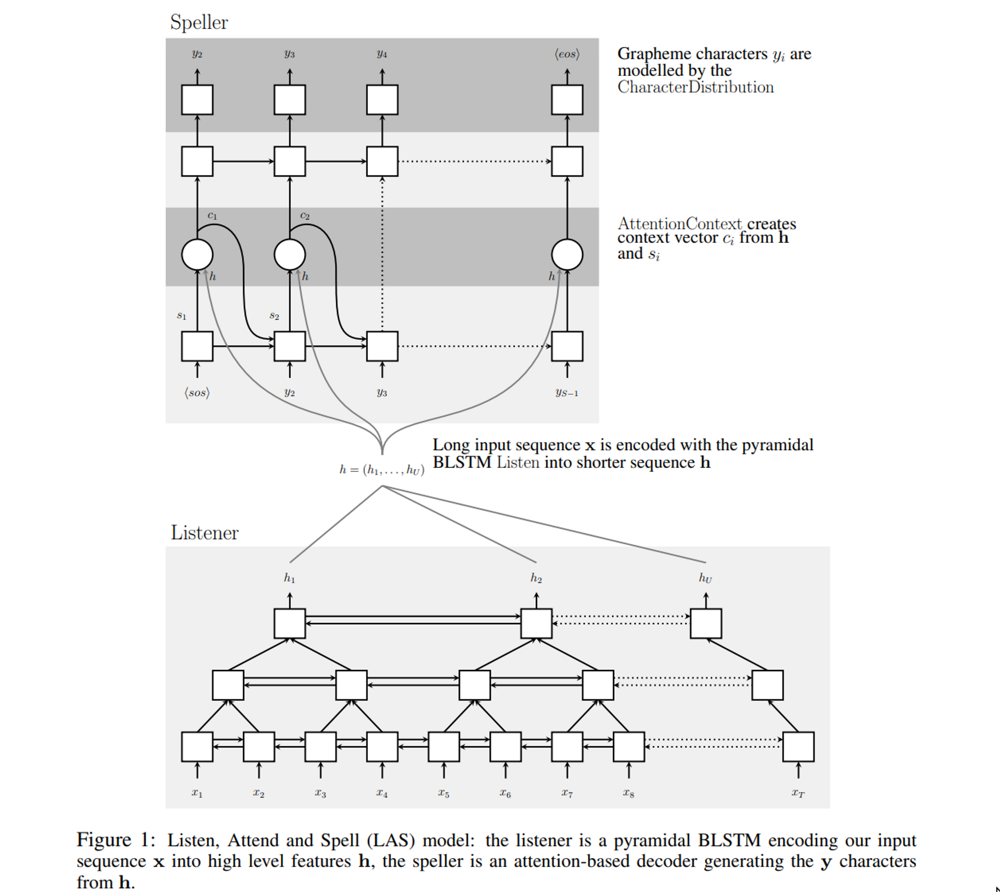
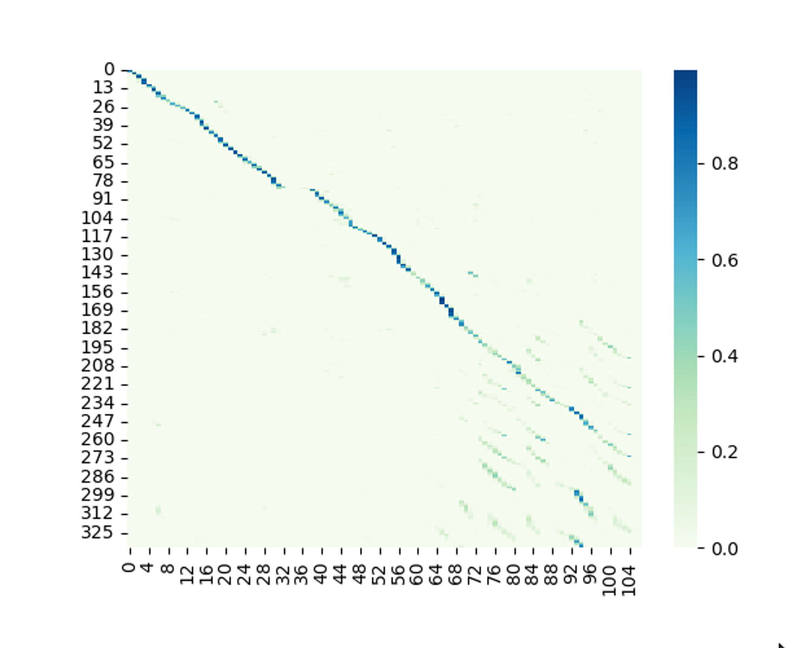

<h1 align="center">
    Automatic Speech Recognition with Listen-Attend-Spell Architecture
</h1>

  <a href="https://sashank-tirumala.github.io/">Sashank Tirumala</a> &nbsp;

<h4 align="center">
  <a href="https://arxiv.org/pdf/1508.01211.pdf"><b>Paper</b></a> 
</h4>

 &nbsp;

## What is this Repository?
This is an implementation of the Listen-Attend-Spell, a Sequence to Sequence Model in Pytorch that is capable of performing Automatic Speech Recognition. A few salient features of this repository are:
1. Custom implementation of Energy based Attention using Batched Matrix Multiplications in Torch.
2. Custom implementation of a recurrent network architecture in the decoder.
3. Custom implementation of a pyramidal LSTM (not available in torch repository).
4. Reaches a WER of 8.0, better than the original paper.

## Installation

1. Use conda to install a custom environment : `conda create -f environment.yaml`
    * `conda activate LAS`
2. `bash install_libraries.bash`

This will create your conda environment

## Preparing the dataset

We use the LibriSpeech dataset with a few pre-processing steps. In particular we convert the audiowaves into MEL spectogram as recommended by the paper. 
For your ease of use, you can simply download the dataset from my google drive with 
* `bash load_data.bash`

## Training a model
The below set of hyperparameters should give you the best performance on this dataset:
* `python train.py --lr 3e-4 -wd 1e-6 -bs 64 -e 100 -nl 4 -nld 3 -ed 256 -dd 256 -ebd 128 -kvs 256 -sim 0 -dp LAS-Dataset/complete -rp runs/ -w 1 -wu 0 -drp 0.3`
In general a few observations regarding the parameters:
1. The bigger the Embed dimensions, Key, Value dimensions are the faster attention converges but also the more memory hungry the model gets.
2. You need a 100% teacher forcing rate till at least the Attention converges, if the teacher forcing rate falls below 60%, attention begins to diverge. In general keep Teacher Forcing Rate around 80% always and only start decreasing it after around 10 epochs. 
3. Removing weight tying, increasing decoder depth, increasing encoder depth did not seem to affect final performance. 

If your hyperparameters are good, your attention should converge in around 10 epochs. Here is how that converged attention would look (quite similar to the paper):

# License

This repository is under MIT License. Feel free to use any part of this code in your projects. Mail stsashank6@gmail.com for any questions. 
